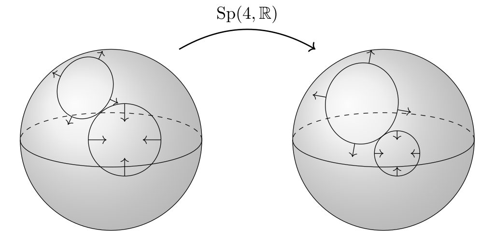

*English below*

## Sphère de Riemann

Ce programme permet de visualiser de manière interactive des transformations sur la sphère de Riemann directement sur internet. 

### Téléchargement et utilisation

* Cliquez sur la version la plus récente (*Latest*) dans la section **Releases** à la droite de l'écran.
* Cliquez sur ``riemannsphere-vx.zip``.
* Dans votre dossier *Téléchargements*, vous devriez y voir ``riemannsphere-vx.zip``, que vous pouvez décompresser (extraire).
* Dans le nouveau dossier *riemannsphere-vx*, double-cliquez sur ``index-fr.html``.

N.B. Si un fichier texte s'ouvre, cliquez sur le bouton droit de la souris et cliquez sur *Ouvrir avec* [votre navigateur web favori]. 

--------------------------------------

## Riemann sphere

This program lets you visualise in an interactive way transformations on the Riemann sphere directly on the internet. 

### Download and usage

* Click on the latest version in the **Releases** section on the right of the screen.
* Click on ``riemannsphere-vx.zip``.
* In your *Downloads* directory, you should see ``riemannsphere-vx.zip``, which you can decompress (extract).
* In the new *riemannsphere-vx* directory, double-click on ``index.html``.

N.B. If a text file opens, right-click on it and click on *Open with* [your favorite web browser].

## License 

MIT